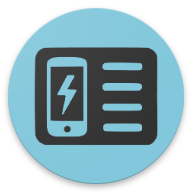

<!--suppress CheckImageSize -->
  

PhoneProfilesPlus (PPP)
===========================

__PhoneProfilesPlus in Discord__
- https://discord.com/channels/1258733423426670633
- Invitation: https://discord.com/invite/gbV7UCzt

__PhoneProfilesPlus in XDA-develoers__
- https://xdaforums.com/t/app-phoneprofilesplus.3799429/

---

### Sources of PhoneProfilesPlus:

Use keyword "PhoneProfilesPlus" for search this application in these stores:

__Droid-ify (F-Droid alternative, preferred over GitHub):__
- [PPP release](https://apt.izzysoft.de/fdroid/index/apk/sk.henrichg.phoneprofilesplus)
- [Store applicaion (download)](https://apt.izzysoft.de/fdroid/index/apk/com.looker.droidify)
  &nbsp;&nbsp;&nbsp;_IzzyOnDroid repository is included_

__Neo Store (F-Droid alternative, preferred over GitHub):__
- [PPP release](https://apt.izzysoft.de/fdroid/index/apk/sk.henrichg.phoneprofilesplus)
- [Store applicaion (download)](https://apt.izzysoft.de/fdroid/index/apk/com.machiav3lli.fdroid)
  &nbsp;&nbsp;&nbsp;_IzzyOnDroid repository is included_

__F-Droid:__
- [PPP release](https://apt.izzysoft.de/fdroid/index/apk/sk.henrichg.phoneprofilesplus)
&nbsp;&nbsp;&nbsp;_[How to add IzzyOnDroid repository to F-Droid application](https://apt.izzysoft.de/fdroid/index/info)_  
- [Store application (download)](https://www.f-droid.org/)

__Huawei AppGallery:__
- [PPP release](https://appgallery.cloud.huawei.com/ag/n/app/C104501059?channelId=PhoneProfilesPlus+application&id=957ced9f0ca648df8f253a3d1460051e&s=79376612D7DD2C824692C162FB2F957A7AEE81EE1471CDC58034CD5106DAB009&detailType=0&v=&callType=AGDLINK&installType=0000)
- [Store application (download)](https://consumer.huawei.com/en/mobileservices/appgallery/)

__APKPure:__
- [PPP release](https://apkpure.net/p/sk.henrichg.phoneprofilesplus)
- [Store application (download)](https://apkpure.net/apkpure/com.apkpure.aegon)

__GitHub (better is using Droid-ify instead):__

- NOTE: Installation from downloaded apk is not recommended for Android 13+ for security reason. Use instead Droid-ify, if in your device is not supported application store, and install PhoneProfilesPlus from it.

- [PPP release (direct download)](https://github.com/henrichg/PhoneProfilesPlus/releases/latest/download/PhoneProfilesPlus.apk)
  &nbsp;&nbsp;&nbsp;_[Number of downloads by version](https://hanadigital.github.io/grev/?user=henrichg&repo=phoneprofilesplus)_

__If is not possible to install PhoneProfilesPlus from the downloaded apk file directly on your device, you can install it from your computer.__
- [Show how](docs/install_apk_from_pc.md)

### Applications required for some PhoneProfilesPlus features:

- __[PhoneProfilesPlusExtender](https://github.com/henrichg/PhoneProfilesPlusExtender)__
- __[PPPPutSettings](https://github.com/henrichg/PPPPutSettings)__

---

__What is PhoneProfilesPlus:__

Android application - manually and by event triggered change of device settings like ringer mode, sounds, Wifi, Bluetooth, launcher wallpaper, ...  
This application is for configuration of device for life situations (at home, at work, in car, sleep, outside, ...) using Profiles.  
In it is also possibility to automatically activate Profiles by Events.  

- [Privacy Policy](https://henrichg.github.io/PhoneProfilesPlus/privacy_policy.html)

_**** Please report me bugs, comments and suggestions to my e-mail: <henrich.gron@gmail.com>. Speed up the especially bug fixes. Thank you very much. ****_

_*** Please help me with translation, thank you: <https://crowdin.com/project/phoneprofilesplus> ***_

##### (HELP) How to grant (G1) permission - for profile parameters that require this permission
- [Show it](docs/grant_g1_permission.md)

##### (HELP) How to using Shizuku (good alternative for non-rooted devices) - for profile parameters that require (Z) permission
- [Show it](docs/shizuku.md)

##### (HELP) How to disable Wi-Fi scan throttling - useful for Wi-Fi scanning
- [Show it](docs/wifi_scan_throttling.md)

##### (HELP) How to configure airplane mode radios - useful for profile parameter "Airplane mode"
- [Show it](docs/airplane_mode_radios_config.md)

### Features
- __[Show it](docs/ppp_features.md)__

##### Permissions
- __[Show it](docs/permissions.md)__

##### Screenshots
- [[1]](art/phoneScreenshots/01.png),
[[2]](art/phoneScreenshots/02.png),
[[3]](art/phoneScreenshots/03.png),
[[4]](art/phoneScreenshots/04.png),
[[5]](art/phoneScreenshots/05.png),
[[6]](art/phoneScreenshots/06.png),
[[7]](art/phoneScreenshots/07.png),
[[8]](art/phoneScreenshots/08.png),
[[9]](art/phoneScreenshots/09.png),
[[10]](art/phoneScreenshots/10.png),
[[11]](art/phoneScreenshots/11.png),
[[12]](art/phoneScreenshots/12.png),
[[13]](art/phoneScreenshots/13.png)

##### Supported Android versions

- From Android 8.0
- minSdkVersion = 26
- targetSdkVersion = 28
- compiledSdkVersion = 34

##### Required external libs - open-source

- AndroidX library: appcompat, preferences, gridlayout, cardview, recyclerview, viewpager2, constraintlayout, workmanager, exifinterface - https://developer.android.com/jetpack/androidx/versions
- Google Material components - https://github.com/material-components/material-components-android
- google-gson - https://code.google.com/p/google-gson/
- ACRA - https://github.com/ACRA/acra
- guava - https://github.com/google/guava
- AutoService = https://github.com/google/auto/tree/main/service
- osmdroid - https://github.com/osmdroid/osmdroid
- TapTargetView - https://github.com/KeepSafe/TapTargetView
- doki - https://github.com/DoubleDotLabs/doki
- dashclock - https://github.com/romannurik/dashclock
- DexMaker - https://github.com/linkedin/dexmaker
- volley - https://github.com/google/volley
- ExpandableLayout - https://github.com/skydoves/ExpandableLayout
- SmoothBottomBar - https://github.com/ibrahimsn98/SmoothBottomBar
- AndroidHiddenApiBypass - https://github.com/LSPosed/AndroidHiddenApiBypass
- Encryption - https://github.com/simbiose/Encryption
- Shizuku - https://github.com/RikkaApps/Shizuku, https://github.com/RikkaApps/Shizuku-API
- RootTools (as module, code modified) - https://github.com/Stericson/RootTools
- RootShell (as module, code modified) - https://github.com/Stericson/RootShell
- time-duration-picker (as module, code modified) - https://github.com/svenwiegand/time-duration-picker
- android-betterpickers (as module, code modified) - https://github.com/code-troopers/android-betterpickers
- AndroidClearChroma (as module, code modified) - https://github.com/Kunzisoft/AndroidClearChroma
- RecyclerView-FastScroll (as module, code modified) - https://github.com/jahirfiquitiva/RecyclerView-FastScroll (original repository: https://github.com/timusus/RecyclerView-FastScroll)
- RelativePopupWindow (only modified class RelativePopupWindow.java) - https://github.com/kakajika/RelativePopupWindow
- SunriseSunset (only modified class SunriseSunset.java) - https://github.com/caarmen/SunriseSunset
- android-hidden-api (downloaded android.jar copied into folder \<android-sdk\>/platforms/android-XX) - https://github.com/Reginer/aosp-android-jar
- NoobCameraFlash (as module, code modified) - https://github.com/Abhi347/NoobCameraFlash
- AutoStarter (only modified class AutoStartPermissionHelper.kt) - https://github.com/judemanutd/AutoStarter
- ToastCompat (as module, code modified) - https://github.com/PureWriter/ToastCompat
- Advance-Android-Tutorials (only modified class ZipManager.java) - https://github.com/stacktipslab/Advance-Android-Tutorials
- Multi-language_App (only modified class LocaleHelper.java) - https://github.com/anurajr1/Multi-language_App

##### Required external libs - not open-source

- Samsung Look - http://developer.samsung.com/galaxy/edge
